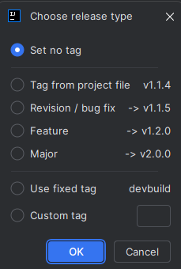
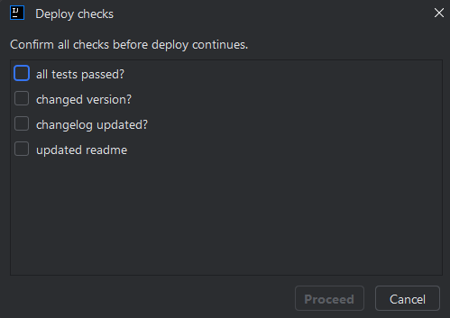
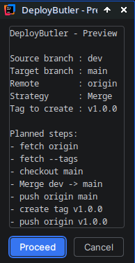

# DeployButler

DeployButler is a JetBrains IDE plugin that supports you with “deploy via Git”: recurring steps are bundled into a guided flow so that releases are consistent, traceable, and created with fewer opportunities for mistakes.

---

## Table of Contents

- [What the plugin does and why you need it](#what-the-plugin-does-and-why-you-need-it)
- [Running it](#running-it)
  - [Run options](#run-options)
    - [Version tagging (release type)](#version-tagging-release-type)
      - [Automatic Project Version Detection](#automatic-project-version-detection)
      - [When Automatic Detection May Not Work](#when-automatic-detection-may-not-work) 
    - [Deploy-Checks](#deploy-checks)
    - [Confirmation before deploy](#confirmation-before-deploy)
    - [Preview mode (dry run)](#preview-mode-dry-run)
    - [Rebase instead of merge](#rebase-instead-of-merge)
- [Settings](#settings)
- [Translations](#translations)
- [License](#license)

---

## What the plugin does and why you need it

DeployButler bundles typical Git steps around a release/deploy process into a clear, guided action inside the IDE.

Typical use cases:

- You want to run deploys following the same pattern every time (same tagging scheme, same target branch, same checks).
- You want to see *what would happen* before the actual deploy, before anything is changed.
- You want to avoid mistakes that commonly happen with manual Git steps (wrong branch, dirty working tree, wrong tag, etc.).
- You have CI/CD workflows that react to version tags (e.g. `v*`) and automatically produce builds/artifacts (release APKs, Docker images, packages, changelogs, GitHub releases, etc.). DeployButler ensures tags are created consistently and reproducibly — so the build process starts reliably without manual “tagging mistakes”.

---

## Running it

Just click on the DeployButler icon in the status bar:

---

## Run options

When starting the deploy flow, you can enable different options depending on how “safe” vs. how “automatic” you want the flow to be.

---

### Version tagging (release type)

DeployButler can let you choose a release type to derive the next version tag.

Typically there are three variants:

- **Revision / bug-fix**: for small fixes without new features
- **Feature**: for new functionality with compatible changes
- **Major**: for bigger changes / potential breaking changes

Additionally, a **tag prefix** can be used (e.g. `v`) so tags are created as `v1.4.0` instead of `1.4.0`.

---

#### Automatic Project Version Detection

Depending on the project structure, DeployButler can also automatically read a version number from a project file and offer it as a tag suggestion.

If a version number can be detected automatically, the release dialog will show an additional option:

- **Tag from project file**

This is especially useful when the version is already maintained inside the project and that exact version should also be used as the Git tag.

DeployButler currently supports the following sources for automatic detection:

- **Gradle**
  - works when the version is defined directly in a Gradle file as a fixed value
  - typical examples are:
    - `version = "1.2.3"`
    - `versionName = "1.2.3"` (for example in Android projects)
  - checks common Gradle files in the project root and also Android-style files inside the `app` directory

- **package.json**
  - works when the project contains a `package.json` with a standard `version` entry
  - typical example:
    - `"version": "1.2.3"`

- **composer.json**
  - works when the `composer.json` explicitly contains a `version` field
  - typical example:
    - `"version": "1.2.3"`
  - note: not every Composer project maintains the version in this file

- **pom.xml**
  - works when the project version is defined directly in the Maven `pom.xml`
  - typical example:
    - `<version>1.2.3</version>`

- **Custom path + regex**
  - for special cases, you can configure a custom file path and a custom regular expression in the settings
  - this makes it possible to detect versions from project-specific or uncommon file formats

---

#### When Automatic Detection May Not Work

Automatic detection is meant as a practical convenience feature and works best when the version is stored **directly as a fixed value in a file**.

Depending on the build setup, version detection may fail, for example when:

- the version is not stored directly as plain text in the file
- the version is assembled from variables, properties, or other build scripts
- the project structure differs significantly from the usual conventions
- the relevant project file does not contain its own explicit version entry

In those cases, you can still use one of the three normal release types, or configure a custom path and regex instead.

> Notes:
> - Which version counts as the “next” one depends on your tagging scheme and the tags already present in the repository.
> - The tag prefix can be changed in the settings. (It may also be left empty.)
> - Automatic version detection is intended as a helper for common project structures, not as a full build analysis.
> - If no version can be detected automatically, that does not necessarily mean the project has no version, only that it is not stored in a directly readable form.

---
### Deploy Checks

If **Deploy Checks** are configured for the current project, an additional confirmation dialog appears before the actual deploy starts.

If no checks have been configured, this step is skipped and no additional check dialog is shown.

The dialog displays all configured checks as individual checkboxes, for example:

- Is the changelog up to date?
- Have the tickets been reviewed?
- Have migrations been considered?
- Has the documentation been updated?

The deploy can only continue once **all checks have been confirmed manually**.

This is useful when you want to enforce recurring release-related checks that Git itself cannot verify, for example:

- whether the changelog has been updated,
- whether certain manual tests have been completed,
- whether accompanying documentation has been adjusted,
- or whether project-specific approvals are in place.

Deploy Checks are intended as an additional mandatory step and help ensure that releases are not only technically correct, but also organizationally complete.

---

### Confirmation before deploy

If **confirmation before deploy** is enabled, DeployButler shows a preview before execution and explicitly asks whether it should proceed.

This is helpful if you want a guided flow, but still want to consciously confirm before the “point of no return”.

---

### Preview mode (dry run)

In **dry run**, the flow is executed in a way that no permanent changes are made.

This is ideal if you want to:

- first check that everything is configured correctly,
- understand the planned flow,
- or see in advance which steps/changes are coming.

---

### Rebase instead of merge

If **rebase instead of merge** is enabled, a more rebase-oriented approach is used for integrating changes (instead of a classic merge).

This can make sense if you:

- prefer a more linear history,
- want to avoid merge commits,
- or your team/repo workflow is built around it.

---

## Settings

DeployButler provides settings to adapt the workflow to your project and release process:

- **Dry run (preview only, no changes)**  
  Runs the workflow in preview mode without making permanent changes.

- **Target branch**  
  The branch the deploy / release process is aimed at (for example `main` or `master`).

- **Remote**  
  The Git remote used for fetch and push operations (typically `origin`).

- **Tag prefix**  
  Optional prefix for version tags (for example `v` → `v1.2.3`).

- **Rebase instead of merge**  
  Uses a rebase-oriented workflow instead of a classic merge.

- **Confirm before deploy (preview dialog)**  
  Shows a preview before execution and asks for confirmation.

- **Deploy Checks**  
  Here you can define any number of manual checks per project that must be confirmed before a deploy can continue.  
  Each check consists of a freely defined text, for example `Is the changelog up to date?` or `Has the documentation been updated?`.  
  Checks can be added, removed, and reordered directly in the settings.

- **Preferred version detector**  
  Lets you prefer one version source over the others when automatic project version detection is used.  
  This is useful if your project contains multiple supported files and DeployButler should try one specific format first.

- **Custom version file path**  
  Lets you define a custom file that should be used for version detection.  
  This is intended for non-standard project layouts or special cases where the version is not stored in the usual default location.

- **Custom version regex**  
  Lets you define your own regular expression for extracting a version from the custom file.  
  This is useful if your project stores the version in a custom format that is not covered by the built-in detectors.

---

## Translations

DeployButler is multilingual. Currently the following languages are included:

- English (default)
- German
- Spanish
- French
- Italian
- Japanese
- Korean
- Dutch
- Polish
- Portuguese
- Russian
- Turkish

Contributions are very welcome — especially for:

- corrections to existing translations
- additional languages
- consistent terminology (e.g. “deploy”, “release”, “preview”, etc.)

---
<!-- deploybutler-version: 7.14.23 -->
## License

[`MIT`](./LICENSE)